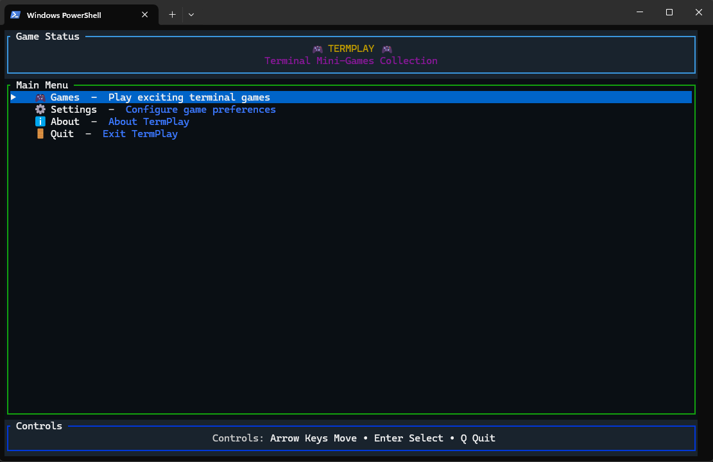
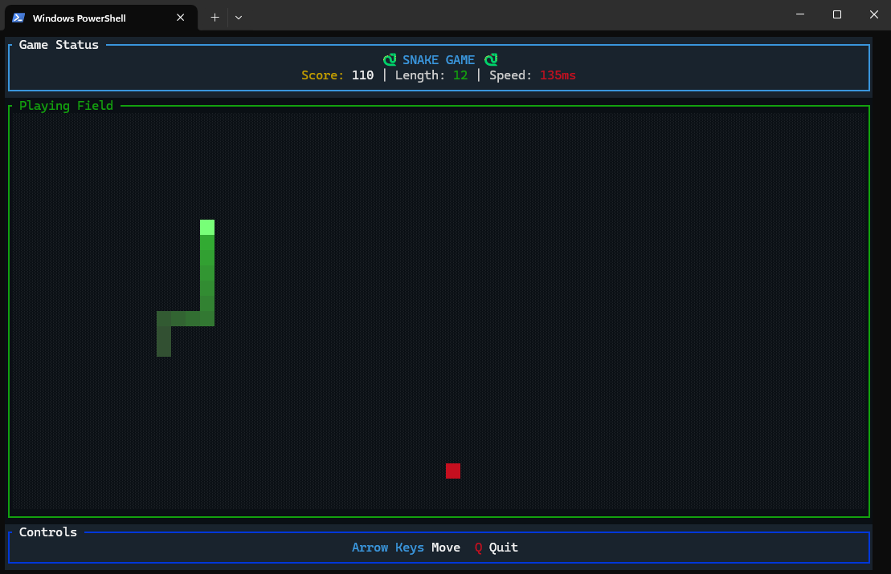

# 🎮 TermPlay

A beautiful collection of **terminal mini-games** built with Rust, featuring modern graphics and smooth gameplay right in your terminal.

[](https://www.rust-lang.org/)
[](https://github.com/MedCy1/TermPlay)
[](https://opensource.org/licenses/Apache-2.0)
[](https://github.com/MedCy1/TermPlay/releases)

## 📸 Screenshots

### 🎮 Main Menu



### 🐍 Snake Game  



### 🧩 Tetris Game


## ✨ Features

- 🎨 **Beautiful UI** - Modern terminal graphics with RGB colors and smooth animations
- 🎮 **Classic Games** - Faithful recreations of beloved retro games
- 🚀 **High Performance** - Built in Rust for speed and reliability
- 🖥️ **Cross Platform** - Works on Windows, macOS, and Linux
- 🎯 **Responsive Design** - Automatically adapts to your terminal size
- 📱 **Intuitive Controls** - Simple keyboard controls for all games
- 🏗️ **Modular Architecture** - Easy to extend with new games
- 🎵 **Rich Audio System** - Sound effects and dynamic music for immersive gameplay
- ⚙️ **Configurable Settings** - Audio controls and game preferences
- 📦 **Easy Installation** - Simple scripts for building and installing

## 🕹️ Available Games

### 🐍 Snake

Classic Snake game with modern visuals and progressive difficulty

- **Square cells** with gradient effects
- **Progressive speed** - Gets faster as you grow
- **Real-time stats** - Score, length, and current speed
- **Smooth controls** with arrow keys

### 🧩 Tetris  

Complete Tetris implementation with all classic features

- **7 authentic tetrominoes** with proper colors and rotations
- **Line clearing** with classic scoring system (40/100/300/1200 points)
- **Progressive levels** - Speed increases every 10 lines
- **Next piece preview**
- **Soft drop** (↓) and **hard drop** (Space)
- **Dynamic music** - Changes tempo based on game intensity

### 🏓 Pong

Classic arcade table tennis with AI opponent

- **AI opponent** with adaptive difficulty
- **Real-time physics** - Realistic ball movement and paddle collision
- **Speed progression** - Ball gets faster as rallies continue
- **Score tracking** - First to reach target score wins

### 🧮 2048

Number puzzle game with smooth tile sliding mechanics

- **Smooth animations** - Tiles slide and merge with visual feedback
- **Score tracking** - Current score and best score persistence
- **Game over detection** - Automatic win/loss detection
- **Undo functionality** - Mistake recovery system

### 💣 Minesweeper

Classic mine detection puzzle game

- **Customizable grid** - Adjustable field size and mine density
- **Flag system** - Mark suspected mines with flags
- **Auto-reveal** - Click empty spaces to reveal connected areas
- **Timer and counter** - Track elapsed time and remaining mines

### 🧱 Breakout

Brick-breaking arcade classic

- **Physics-based gameplay** - Realistic ball and paddle physics
- **Progressive difficulty** - Multiple levels with different brick layouts
- **Power-ups** - Special abilities and enhanced gameplay mechanics
- **Combo system** - Score multipliers for consecutive hits

### 🔬 Conway's Game of Life

Cellular automaton simulation and visualization

- **Interactive controls** - Play, pause, step-through, and reset
- **Dynamic grid** - Resizable playing field that adapts to terminal
- **Pattern editing** - Click to toggle cell states and create patterns
- **Speed control** - Adjustable simulation speed

## 🚀 Installation

### From Source

```bash
git clone https://github.com/MedCy1/TermPlay.git
cd TermPlay
cargo build --release
```

### Using Install Script

```bash
# Make install script executable and run
chmod +x scripts/install.sh
./scripts/install.sh
```

### Quick Start

```bash
# Launch the main menu
./target/release/termplay

# Or play a specific game directly
./target/release/termplay game snake
./target/release/termplay game tetris
./target/release/termplay game pong
./target/release/termplay game 2048
./target/release/termplay game minesweeper
./target/release/termplay game breakout
./target/release/termplay game gameoflife

# List all available games
./target/release/termplay list
```

## 🎮 How to Play

### Main Menu Navigation

- **↑/↓** - Navigate menu options
- **Enter** - Select option
- **Q** - Quit
- **Esc** - Go back (in submenus)

### Snake Controls

- **Arrow Keys** - Move snake
- **Q** - Quit to menu
- **R** - Restart (when game over)

### Tetris Controls

- **←/→** - Move piece left/right
- **↓** - Soft drop (faster descent + 1 point per line)
- **↑** - Rotate piece
- **Space** - Hard drop (instant drop + 2 points per line)
- **Q** - Quit to menu
- **R** - Restart (when game over)

### Pong Controls

- **↑/↓** - Move paddle up/down
- **Q** - Quit to menu
- **R** - Restart (when game over)

### 2048 Controls

- **Arrow Keys** - Slide tiles in direction
- **Q** - Quit to menu
- **R** - Restart game
- **U** - Undo last move

### Minesweeper Controls

- **Arrow Keys** - Move cursor
- **Space** - Reveal cell
- **F** - Flag/unflag cell
- **Q** - Quit to menu
- **R** - Restart game

### Breakout Controls

- **←/→** - Move paddle left/right
- **Space** - Launch ball (when paused)
- **Q** - Quit to menu
- **R** - Restart (when game over)

### Conway's Game of Life Controls

- **Space** - Play/pause simulation
- **S** - Step one generation
- **R** - Reset/clear grid
- **Arrow Keys** - Move cursor
- **Enter** - Toggle cell state
- **Q** - Quit to menu

## 🛠️ Technical Details

### Built With

- **[Rust](https://www.rust-lang.org/)** - Systems programming language for performance and safety
- **[Ratatui](https://github.com/ratatui-org/ratatui)** - Modern terminal UI library
- **[Crossterm](https://github.com/crossterm-rs/crossterm)** - Cross-platform terminal manipulation
- **[Clap](https://github.com/clap-rs/clap)** - Command line argument parsing
- **[Rand](https://github.com/rust-random/rand)** - Random number generation
- **[Rodio](https://github.com/RustAudio/rodio)** - Audio playback library for sound effects and music
- **[Serde](https://github.com/serde-rs/serde)** - Serialization framework for configuration management
- **[Dirs](https://github.com/dirs-dev/dirs-rs)** - System directory discovery

### Architecture

- **Modular Game System** - Each game implements a common `Game` trait
- **Dynamic Registration** - Games are automatically registered and discoverable
- **Responsive Rendering** - Games adapt to terminal dimensions
- **Event-Driven** - Efficient input handling with configurable tick rates
- **Audio System** - Centralized audio management with per-game music and sound effects
- **Configuration Management** - Persistent settings with JSON-based configuration files

### Performance

- **Optimized Rendering** - Only redraws changed areas
- **Memory Efficient** - Zero-allocation hot paths where possible
- **Low Latency** - Sub-50ms input response times
- **Adaptive Refresh** - Games can control their own update frequency

## 🎯 Scoring Systems

### Snake

- **+10 points** per food eaten
- **Speed bonus** - Faster gameplay as snake grows
- Final score based on snake length and survival time

### Tetris

- **Single line:** 40 × level
- **Double lines:** 100 × level  
- **Triple lines:** 300 × level
- **Tetris (4 lines):** 1200 × level
- **Soft drop:** +1 point per line
- **Hard drop:** +2 points per line
- **Level progression:** Every 10 lines cleared

### Pong

- **+1 point** per successful return
- **First to reach target score** wins the match

### 2048

- **Tile merge value** - Points equal the value of the merged tile
- **Best score tracking** - Persistent high score storage

### Minesweeper

- **Time-based scoring** - Faster completion = higher score
- **Accuracy bonus** - Fewer mistakes = bonus points

### Breakout

- **Brick value scoring** - Different brick types have different point values
- **Combo multipliers** - Consecutive hits increase score multiplier

## 🔧 Development

### Adding New Games

1. Create a new file in `src/games/your_game.rs`
2. Implement the `Game` trait:

   ```rust
   impl Game for YourGame {
       fn name(&self) -> &str { "your_game" }
       fn description(&self) -> &str { "Your game description" }
       fn handle_key(&mut self, key: KeyEvent) -> GameAction { /* ... */ }
       fn update(&mut self) -> GameAction { /* ... */ }
       fn draw(&mut self, frame: &mut Frame) { /* ... */ }
       fn tick_rate(&self) -> Duration { /* optional */ }
   }
   ```

3. Register in `src/games/mod.rs`
4. Your game automatically appears in the menu!

### Building for Different Platforms

```bash
# Windows
cargo build --release --target x86_64-pc-windows-gnu

# macOS  
cargo build --release --target x86_64-apple-darwin

# Linux
cargo build --release --target x86_64-unknown-linux-gnu

# ARM64 (Apple Silicon, ARM Linux)
cargo build --release --target aarch64-apple-darwin
cargo build --release --target aarch64-unknown-linux-gnu
```

### Release Management

```bash
# Use the release script for automated versioning and building
./scripts/release.sh

# This script handles:
# - Version bumping
# - Cross-platform compilation
# - Asset packaging
# - Release notes generation
```

## 📋 TODO / Roadmap

### ✅ Completed

- [x] **Snake** - Classic snake game with progressive difficulty and modern graphics
- [x] **Tetris** - Complete implementation with line clearing, levels, and authentic gameplay
- [x] **Pong** - Classic paddle game with AI opponent and physics-based gameplay
- [x] **2048** - Number sliding puzzle game with smooth animations
- [x] **Minesweeper** - Classic mine detection game with customizable difficulty
- [x] **Breakout** - Brick breaking arcade game with physics and power-ups
- [x] **Conway's Game of Life** - Interactive cellular automaton visualization
- [x] **Audio System** - Complete sound effects and dynamic music system
- [x] **Menu System** - Beautiful navigation with Games, Settings, and About sections
- [x] **Configuration System** - Persistent audio and game settings
- [x] **Cross-platform Support** - Works seamlessly on Windows, macOS, and Linux (including ARM64)
- [x] **CI/CD Pipeline** - Automated building, testing, and release management
- [x] **Installation Scripts** - Easy setup and deployment tools

### 🚧 In Progress / Planned

- [ ] **High Scores** - Persistent leaderboards for each game
- [ ] **Themes** - Customizable color schemes and visual styles
- [ ] **Game Replays** - Record and playback game sessions
- [ ] **Advanced Settings** - Per-game configuration options
- [ ] **Tournament Mode** - Compete across multiple games
- [ ] **Online Features** - Leaderboards and multiplayer capabilities

## 🤝 Contributing

Contributions are welcome! Please feel free to submit a Pull Request. For major changes, please open an issue first to discuss what you would like to change.

1. Fork the Project
2. Create your Feature Branch (`git checkout -b feature/AmazingFeature`)
3. Commit your Changes (`git commit -m 'Add some AmazingFeature'`)
4. Push to the Branch (`git push origin feature/AmazingFeature`)
5. Open a Pull Request

## 🐛 Bug Reports

If you encounter any bugs or have feature requests, please [open an issue](https://github.com/MedCy1/TermPlay/issues) with:

- Your operating system and terminal
- Steps to reproduce the issue
- Expected vs actual behavior
- Screenshots if applicable

## 📜 License

This project is licensed under the Apache License 2.0 - see the [LICENSE](LICENSE) file for details.

## 🙏 Acknowledgments

- Inspired by classic arcade games and modern terminal applications
- Built with the amazing Rust ecosystem
- Special thanks to the Ratatui and Crossterm communities

---

**Made with ❤️ by [MedCy1](https://github.com/MedCy1)**

*Enjoy playing classic games in your terminal! 🎮*
